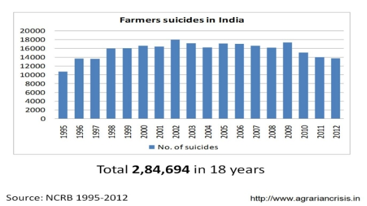

# CODERUN-48Hours Hackathon

## AgroWorld

### Problem Statement:
In today's agricultural landscape, farmers face challenges in efficiently connecting with the most suitable buyers for their produce. The lack of a streamlined platform results in inefficiencies, delayed transactions, and missed opportunities for both farmers and buyers. The existing channels often involve intermediaries, leading to increased costs and reduced profits for farmers, while buyers may struggle to access a diverse range of produce. There is a pressing need for an innovative solution that directly connects farmers to the right buyers, facilitating seamless transactions, fair pricing, and a more sustainable agricultural ecosystem.

### Conventional farming supply chain:

### The conventional supply chain in farming has several disadvantages:**

1. **Longer** **Supply** **Chains**: Conventional farming often involves a long and complex supply chain with multiple intermediaries between the farmer and the end consumer. This elongated chain can result in increased costs, longer delivery times, and decreased freshness of produce.
1. **Lack of** **Transparency**: With numerous middlemen involved, there's often a lack of transparency in the conventional supply chain. Farmers might not have a clear understanding of where their produce ends up or the prices it eventually sells for, leading to potential exploitation.
1. **High Wastage**: The longer the supply chain, the higher the chances of food spoilage and wastage. Produce might perish or lose quality during transportation and storage, leading to significant losses for both farmers and consumers.
1. **Dependency on Intermediaries**: Farmers in conventional supply chains might become overly reliant on middlemen or distributors for selling their produce. This dependency can lead to unfair pricing, as farmers might not have negotiation power and could receive lower prices for their goods.
1. **Environmental Impact**: Conventional supply chains often involve excessive packaging, transportation over long distances, and inefficient practices that contribute to a larger carbon footprint. This impacts the environment negatively through increased greenhouse gas emissions and resource depletion.
1. **Inefficiency and Inflexibility**: Traditional supply chains can be less adaptable to changes in demand or unforeseen circumstances. They might struggle to quickly pivot in response to market fluctuations or unexpected events like extreme weather conditions or global crises.
1. **Quality and Nutritional** **Loss**: Long transportation times and storage can lead to a loss of nutritional value in produce. The delay between harvesting and reaching the consumer can diminish the overall quality of the food.
1. **Economic Challenges for Small Farmers**: Small-scale farmers within conventional supply chains often face challenges in accessing markets directly, and their profits can be significantly reduced due to the cuts taken by intermediaries. This can perpetuate a cycle of poverty for small-scale farmers.
1. **Reduced Community Engagement**: With a lengthy supply chain, the connection between farmers and consumers can diminish. Consumers might not have a clear understanding of where their food comes from, which can lead to a lack of appreciation for local farming communities and their efforts.

### Farmer Suicides in India:

## Our Solution:

We will be building a platform that will function as a market place and supply chain.

There are some problems which we have to address to lead to a more effective system compared to our current system.

- A reliable market place which can act as an interface between farmers and consumers, eliminating any middlemen
- Absence of proper grading system to know the quality of the material beforehand
- A transparent money transaction system
- Application of algorithms to make the app user friendly

### RELIABLE MARKET PLACE

**Famer Point of View:**

It all start with farmer signing up using only Mobile number and name, because some of the farmers don’t know the advance login system like email etc. Once a farmer wants to sell a product, he can advertise his product (with price and quantity). In addition to this the farmer will be given suggestions of the optimal crop to grow based the current conditions of the area. Similarly, suggesting them for the best time to sell the product to get maximum profit out of the product. Additionally crops price are shown with respect to state and their district.

**Consumer Point of View:**

The consumer will be provided with suggestions based on the product purchased previously. Once a consumer searches for a product, the list of available farmers along with the price and the farmer’s rating. The consumer will also be shown a list of logistics according to his need.

**Storage house Point of View:**

Some of the farmer who do not have sufficient space or storage to store their product/crop for very long period of time in case their crop will not selling as per prediction. So To solve this, Storage house person can also add there Storage room/house for farmer and for the storing, farmer have to pay their rent.

This would create an effective marketplace which helps in the interaction between farmers and the consumers thus eliminating any middlemen.

### Absence of proper grading system to know the quality of the material beforehand:

As a general rule, there is hardly any grading of the commodities to be marketed. Therefore, the consumer has little confidence, if any, in the quality of the product(s). This brings us to the second part of building a multilayer grading system that is unlike the conventional grading systems which we see in all the existing e-commerce product. The rating will be based on different aspects of the products like quality, punctuality, packing of the product, similar rating will be given for the transportation also. Thus, making it easier for the consumer to decide between products.

### FUTURE PLANS:

- Multilingual Support
- Chatbot to help users within the app
- Redesign the User Interface for better cognitive ease

### Technology Stack:

- Flutter (Dart)
- Android Studio

### Dependencies:

The hurdle that we could face is the fact, that most of the farmers of our country are illiterate, hence they wouldn’t know how to use the app.

The solution we propose for this is, that make the farmers educated about using the app by holding government camps in villages, by radio or television advertisements. Hence the famers would use the app in an effective way.
